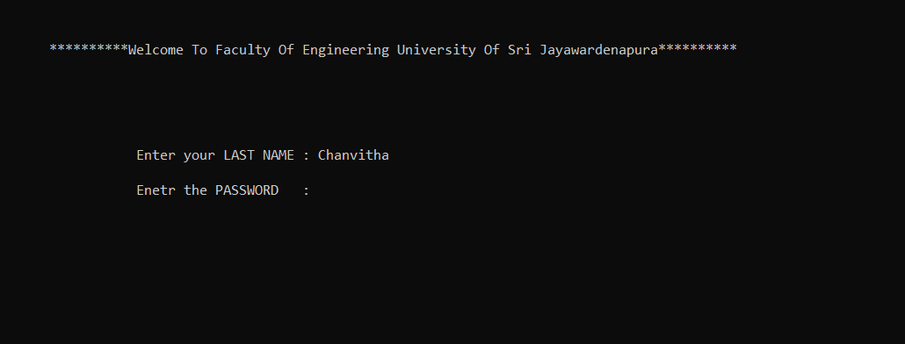
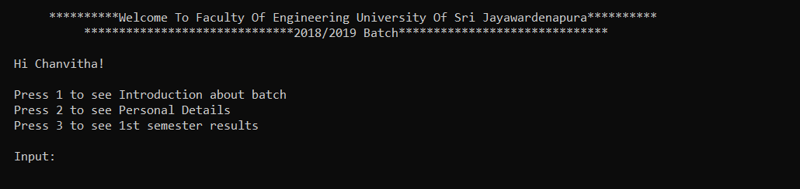
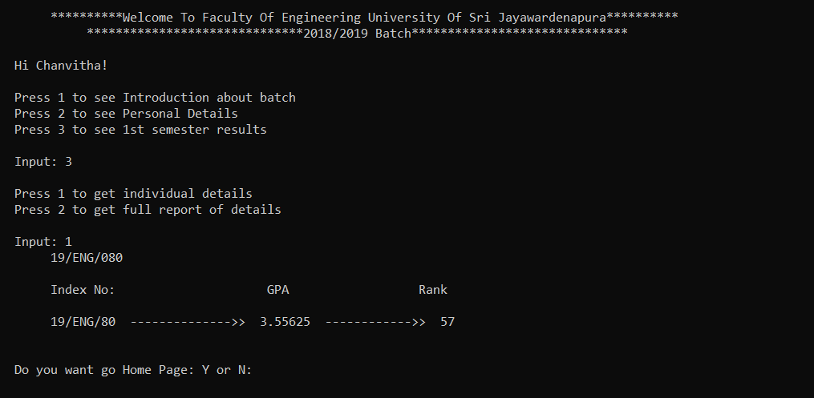

<h1 align="center">
   
  Student Details System in C++
   
</h1>

<h4 align="center">Simple C++ console application to review university students' academic details.</h4>

  
  
  
   
  <a href="#description">Description</a> 

## Description

Simply refer to the instructions given by the console and set input data to get outputs.

  
  
  
